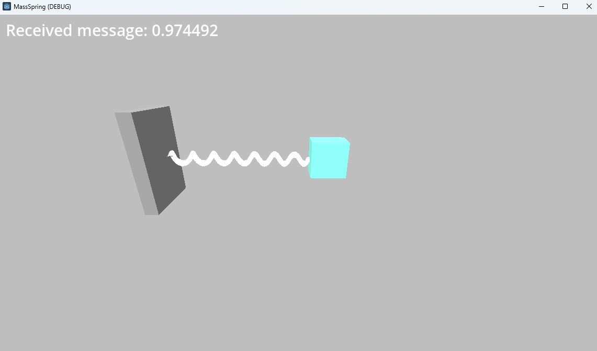

# Example Distributed Co-simulation

This repository shows an example of distributed co-simulation using the following technologies:
- [Docker](https://www.docker.com/): for virtualization
- [RabbitMQ](https://www.rabbitmq.com/): for communication
- [RabbitMQFMU](https://github.com/INTO-CPS-Association/fmu-rabbitmq): bridge between RabbitMQ and co-simulation
- [Godot](https://godotengine.org/): for visualization
- [Maestro](https://github.com/INTO-CPS-Association/maestro): for co-simulation orchestration

Slides giving an overview of each technology:
- [Docker](slides/Docker_slides.pdf): for virtualization
- [RabbitMQ](slides/FMICosim.pdf): for communication
- [RabbitMQFMU](slides/RabbitMQ.pdf): bridge between RabbitMQ and co-simulation
- [Godot](slides/Godot_slides.pdf): for visualization
- [Maestro](slides/FMICosim.pdf): for co-simulation orchestration

## Instructions

In the following instructions whenever we ask to run a particular command it means to open a terminal in the current folder and run the command.

1. Install [Docker Desktop](https://www.docker.com/products/docker-desktop/) or equivalent for your platform.
   Follow instructions in [Installing Docker For Windows](#installing-docker-for-windows)
1. (Optional) If you do not wish to use the Rabbitmq server provided in [rabbitmqserver](rabbitmqserver), contact Claudio Gomes <claudio.gomes@ece.au.dk> for access to RabbitMQ on AWS.
2. Open a terminal in the current folder and run the following to start all services: `docker-compose up`

   The first time this is run, docker will pull and build all the required Docker images.
   You can delete these images in your Docker desktop management interface later to recover disk space.

3. Wait for all services to be up and running. You should be able to open the [rabbitmq server interface](http://localhost:15672/). 
   - User: guest
   - Pass: guest
4. Open another terminal and run the following to connect to the controller-container 
   1. `docker exec -it controller-container /bin/bash`
   2. `python3 control.py`
5. (Optional) If you wish to visualize the 3D example, 
   1. follow the [Godot instructions](mass_spring_model_godot/README.md) 
   3. run the [Godot project](mass_spring_model_godot/project.godot).
6. Open another terminal and run the following to connect to the rabbitmqfmu-container
   1. `docker exec -it rabbitmqfmu-container /bin/bash`
   2. `./run_cosim.sh`
7. The co-simulation is now running and you should see the following outputs
   
   control.py:
   ```
   {'time': '2023-09-17T07:40:41.357+00:00', 'fk': 1.0}
   [x] b'{"x":0.973394, "timestep":"2023-09-17T07:40:41.367+00:00", "simstep":"7510.000000"}'
   2023-09-17T07:40:41.367+00:00
   Sent:
   {'time': '2023-09-17T07:40:41.367+00:00', 'fk': 1.0}
   [x] b'{"x":0.973461, "timestep":"2023-09-17T07:40:41.378+00:00", "simstep":"7520.000000"}'
   2023-09-17T07:40:41.378+00:00
   Sent:
   {'time': '2023-09-17T07:40:41.378+00:00', 'fk': 1.0}
   [x] b'{"x":0.97353, "timestep":"2023-09-17T07:40:41.387+00:00", "simstep":"7530.000000"}'
   2023-09-17T07:40:41.387+00:00
   Sent:
   {'time': '2023-09-17T07:40:41.387+00:00', 'fk': 1.0}
   ```

   godot project:
   

   run_cosim.sh
   ```
   WARNING: sun.reflect.Reflection.getCallerClass is not supported. This will impact performance.
   07:40:31.664 [main] WARN  org.intocps.maestro.framework.fmi2.api.mabl.FromMaBLToMaBLAPI - Failed to find instance required by relational information from simulation env. Missing 'm' in relation E c.fk -> [m.fk]
   07:40:31.677 [main] WARN  org.intocps.maestro.framework.fmi2.api.mabl.FromMaBLToMaBLAPI - Failed to find instance required by relational information from simulation env. Missing 'c' in relation E m.x -> [c.x]
   Interpretation load took: 490938090
   Interpretation load took: 64083757
   Model description path: /fmus/rmq_controller/rmqfmuv2.1.5/resources/modelDescription.xml
   Interpretation instantiate took: 65231588
   Interpretation instantiate took: 3199692

   Opened channel with ID: 1
   Declaring exchange on channel with ID: 1
   Exchange name: example_exchange exchange type: direct

   Opened channel with ID: 2
   Opened channel with ID: 1
   Declaring exchange on channel with ID: 1
   Exchange name: example_exchange_sh exchange type: direct

   Opened channel with ID: 2Interpretation time: 11203646691 PT11.203621S
   ```

8.  Exit all the above terminals.
9.  Run `docker-compose down` -> Removes all containers


## Installing Docker For Windows

**Prerequisites:**
- A 64-bit processor
- 4GB RAM
- Windows 10 Home/Pro or Windows 11 Home/Pro

**Steps:**
1. Install the [Docker Engine](https://docs.docker.com/desktop/install/windows-install/)
2. Install the [Windows Subsystem for Linux (WSL)](https://learn.microsoft.com/en-us/windows/wsl/install). To leverage applications based on Linux, the Docker engine needs to run on WSL. WSL lets Linux distributions run on Windows. 
    1. Open Powershell or Windows Command Prompt in adminstrator mode
    2. Run the command:  ``` wsl --install ```
    3. Restart your machine.
  
If the above command does not work, go through the [manual installation of WSL](https://learn.microsoft.com/en-us/windows/wsl/install-manual).


### Using Docker to run a co-simulation

1. Open a Powershell or Terminal and move to the [maestro_stand_alone](./maestro_stand_alone) folder. You can change the directory using the ``` cd ``` command. 
2. Build the docker image by running the command: ``` docker build -t maestro:latest . ```
3. Go one folder back to the main folder: ``` cd .. ```
4. Start the container: ``` docker container run --rm --name maestro-container -v ${pwd}\maestro_stand_alone:/maestro_stand_alone -v ${pwd}\fmus:/fmus -w /maestro_stand_alone -it maestro:latest /bin/bash ```
5. Then inside the container, run the following commands:
   1. ``` java -jar maestro.jar sigver generate-algorithm scenario.conf -output results ```
   2. ``` java -jar maestro.jar sigver execute-algorithm -mm multiModel.json -ep executionParameters.json -al results/masterModel.conf -output results -di -vim FMI2 ```

## Testing RabbitMQ Server

This example is a simple demonstration of how RabbitMQ works. It consists of a receiver and a server that communicates with via the RabbitMQ message broker. 

**How to run the example**
1. Run the RabbitMQ server locally using Docker (see steps above)
1. Run the receiver:
   1. Open a terminal and move to the [rabbitmqserver](rabbitmqserver) folder where [Receiver.py](rabbitmqserver/Receiver.py) is located
   2. Run the command: ```python Receiver.py``` 
2. Run the sender:
   1. Open a terminal move to the [rabbitmqserver](rabbitmqserver) folder where [Sender.py](rabbitmqserver/Sender.py) is located
   2. Run the command: ```python Sender.py``` 


## Old Instructions - Kept for Troubleshooting

Instructions that do not use Docker-Compose (useful for troubleshooting the virtual machines individually):
1. Install Docker Desktop or equivalent for your platform
2. Create custom network: `docker network create --subnet=172.20.0.0/16 examplenetwork`
3. Setup and test rabbitmq:
   1. CD to [rabbitmqserver](./rabbitmqserver)
   2. `docker build -t rabbitmq:latest .`
   3. `docker container run --rm --name rabbitmq-server -p 5672:5672 -p 15672:15672 -p 1883:1883 --network=examplenetwork --ip=172.20.0.2 rabbitmq:latest`
   4. This will launch it at localhost `5672` for TCP communication and http://localhost:15672 will serve the management interface. The default login is username: `guest` and password: `guest`. If rabbitmq is running but the webpage does not load, and you're on windows, check that the hosts file contains entries `127.0.0.1    localhost` and `::1           localhost`.
   5. `python .\consume.py`
   6. `python .\publish.py`
4. Export FMUs for linux machines.
   1. Use [OpenModelica](https://openmodelica.org/download/download-linux/) from a linux machine, or use [Linux Subsystem for Windows](https://learn.microsoft.com/en-us/windows/wsl/tutorials/gui-apps) 
   2. Open models and export them as FMUs.
5. Run distributed scenario:
   1. Make sure rabbitmq-server container is running (see previous step)
   2. Start controller python running in local machine.
      1. CD to [distributed_ctrl_python](./distributed_ctrl_python)
      2. `python .\control.py`
   3. Start distributed_oneway
      1. CD to [distributed_oneway](./distributed_oneway)
      2. `docker build -t rabbitmqfmu:latest .`
      3. `cd ..`
      4. `docker container run --rm --name rabbitmqfmu-container -v ${pwd}\distributed_oneway:/distributed_oneway -v ${pwd}\fmus:/fmus -w /distributed_oneway --network=examplenetwork  -it rabbitmqfmu:latest /bin/bash`
         1. `java -jar maestro.jar sigver generate-algorithm scenario.conf -output results`
         2. `java -jar maestro.jar sigver execute-algorithm -mm multiModel.json -ep executionParameters.json -al results/masterModel.conf -output results -di -vim FMI2`


### Troubleshooting rabbitmqfmu missing dependencies

- `wget http://archive.ubuntu.com/ubuntu/pool/main/i/icu/libicu66_66.1-2ubuntu2_amd64.deb`
- `dpkg -i libicu66_66.1-2ubuntu2_amd64.deb`
- https://stackoverflow.com/questions/72133316/libssl-so-1-1-cannot-open-shared-object-file-no-such-file-or-directory
- Add missing parameters in modeldescription
   ```
   <ScalarVariable name="config.ssl" valueReference="16" variability="fixed" causality="parameter" initial="exact">
      <Boolean start="true"/>
   </ScalarVariable>
   <ScalarVariable name="config.queueupperbound" valueReference="17" variability="fixed" causality="parameter" initial="exact">
      <Integer start="100"/>
   </ScalarVariable>
   ```

### Other commands for testing containers

- `docker network ls`
- `docker container run --rm --name ping --network=examplenetwork -it myubuntu /bin/bash`
- `docker container run --rm --name consume --network=examplenetwork -v $pwd\aux_scripts:/aux_scripts -w /aux_scripts -it myubuntu /bin/bash`
  - `apt-get install python3 python-pip3`
- `docker inspect rabbitmq-server`
